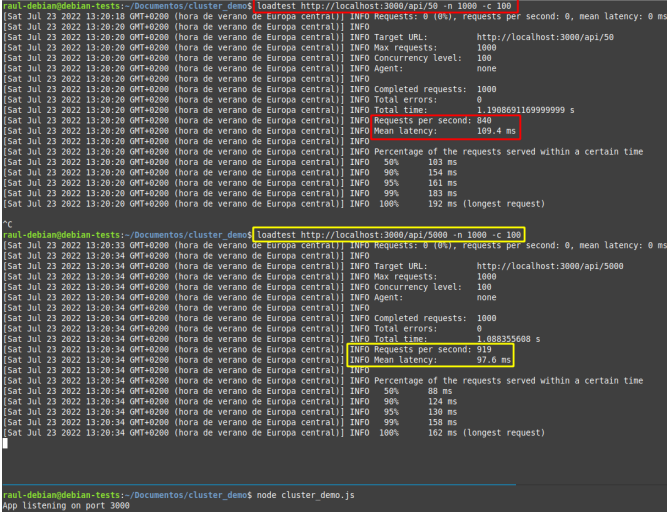
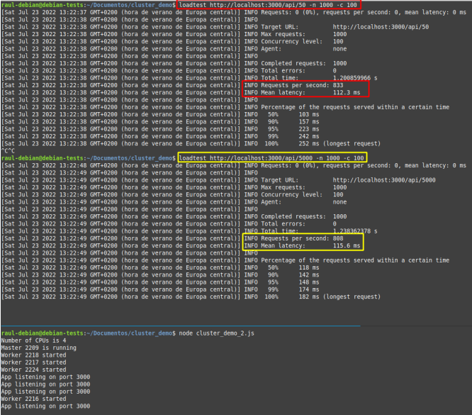

# Despliegue de una aplicación en cluster con Node Express

## Instalación de Dependencias en la VM

Dentro de la máquina virtual, ejecutamos los codigos para actualizar el sistema y para instalar Node.js y npm:

```sh
sudo apt update && sudo apt install -y nodejs npm
```

Verifica la instalación:

```sh
node -v
npm -v
```

## Creación de la Aplicación Node.js

1. **Crear el directorio del proyecto y configurarlo:**

   Esto inicializa un proyecto Node.js y genera un `package.json`.

   ```sh
   mkdir cluster_app && cd cluster_app
   npm init -y
   ```
   
2. **Instalar Express.js:**  

   Express.js nos permite crear un servidor web en Node.js.

   ```sh
   npm install express
   ```

## Código de la Aplicación en Clúster (`cluster_app.js`)

Este código usa `cluster` para distribuir la carga entre los CPU disponibles.

```js
const express = require("express");
const cluster = require("cluster");
const os = require("os");

const totalCPUs = os.cpus().length;
const port = 3000;

if (cluster.isMaster) {
    console.log(`Master ${process.pid} está corriendo`);
    
    for (let i = 0; i < totalCPUs; i++) {
        cluster.fork();
    }

    cluster.on("exit", (worker) => {
        console.log(`Worker ${worker.process.pid} murió, creando otro...`);
        cluster.fork();
    });
} else {
    const app = express();

    app.get("/", (req, res) => {
        res.send(`Hola desde Worker ${process.pid}`);
    });

    app.listen(port, "0.0.0.0", () => {
        console.log(`Worker ${process.pid} escuchando en puerto ${port}`);
    });
}
```

Este código `NO` usa `cluster`.

```js
const express = require("express");
const app = express();
const port = 3000;
const limit = 5000000000;

app.get("/", (req, res) => {
    res.send("Hello World!");
});

app.get("/api/:n", function (req, res) {
    let n = parseInt(req.params.n);
    let count = 0;

    if (n > limit) n = limit;

    for (let i = 0; i <= n; i++) {
        count += i;
    }

    res.send(`Final count is ${count}`);
});

app.listen(port, () => {
    console.log(`App listening on port ${port}`);
});
```

## Ejecución de la Aplicación

Para ejecutar la aplicación en la VM sin cluster, usa:

```sh
node app.js
```


Accede desde el navegador:

```sh
http://localhost:3000
http://localhost:3000/api/50
```


```sh
node cluster_app.js
```


Accede desde el navegador:

```sh
http://192.168.57.102:3000
http://192.168.57.102:3000/api/5000
```


## Uso de PM2 para Administrar el Clúster

1. **Instalar PM2** 

PM2 ayuda a manejar procesos en producción.

```sh
npm install -g pm2
```

2. **Crear archivo de configuración `ecosystem.config.js`**

```js
module.exports = {
    apps: [{
        name: "cluster_app",
        script: "cluster_app.js",
        instances: 0,
        exec_mode: "cluster"
    }]
};
```

3. **Iniciar la aplicación con PM2**

```sh
pm2 start ecosystem.config.js
```


4. **Comandos útiles de PM2**

```sh
pm2 ls
```


```sh
pm2 logs
```


```sh
pm2 monit
```


```sh
pm2 stop cluster_app
```


## Pruebas de Carga con `loadtest`

Para intalar loadtest y nodejs, actualizado:

```bash
sudo apt-get remove -y nodejs npm
curl -fsSL https://deb.nodesource.com/setup_16.x | sudo -E bash -
sudo apt-get install -y nodejs
node -v  # Debería mostrar v16.x.x
sudo npm install -g loadtest
```

1. **Instalar `loadtest`**  
   `loadtest` permite simular cargas de peticiones al servidor.

```sh
npm install -g loadtest
```

2. **Ejecutar pruebas con y sin clúster**

```sh
loadtest http://192.168.57.102:3000 -n 1000 -c 100
```

**Sin Cluster**

.png)

**Con Cluster**

.png)

## Respuesta a la Cuestión Final  

En algunos casos concretos, la aplicación **sin clusterizar** puede obtener mejores resultados en las pruebas de carga debido a varios factores clave relacionados con la forma en que Node.js maneja los procesos y la concurrencia.  





`La primera imagen ilustra los resultados de unas pruebas de carga sobre la aplicación sin clúster y la segunda sobre la aplicación clusterizada`

### Observaciones Basadas en la Práctica Realizada  

- **En las pruebas realizadas, se observó que la aplicación sin clúster mostró mejor rendimiento en cargas bajas**. Esto confirma la teoría de que el overhead de creación y gestión de workers puede ser perjudicial en ciertas situaciones.
- **El uso de PM2 permitió una mejor gestión del clúster**, manteniendo la estabilidad de la aplicación sin intervención manual.
- **Las pruebas con `loadtest` demostraron que la aplicación clusterizada tiene una mayor capacidad de manejo de múltiples peticiones simultáneas**, aunque en algunos casos la latencia aumentó debido a la administración de procesos.

1. **Overhead de Creación y Comunicación entre Workers**  

Cuando se usa el módulo `cluster` en Node.js, el proceso maestro debe administrar la distribución de las solicitudes entre los workers. Esta coordinación introduce un **overhead adicional** en comparación con un único proceso que simplemente gestiona las solicitudes de forma secuencial.  

- En cargas ligeras, este overhead puede generar una ligera pérdida de eficiencia, ya que el beneficio de la distribución de carga aún no compensa el costo de gestionar múltiples procesos.  
- Si las solicitudes son muy simples y rápidas (como devolver una respuesta estática), la versión sin clúster puede responder más rápidamente sin necesidad de dividir la carga.  

2. **Uso de Memoria y Cambio de Contexto**  

Cada worker en un clúster es un **proceso independiente**, lo que significa que consume memoria adicional y requiere cambios de contexto en la CPU.  

- Si la cantidad de memoria disponible es limitada, tener múltiples workers puede hacer que el sistema tenga que **gestionar más procesos**, lo que podría degradar el rendimiento.  
- En cambio, un único proceso sin clúster consume menos memoria y puede ejecutarse de manera más fluida en situaciones donde los recursos son limitados.  

3. **Estrategia de Balanceo de Carga**  

Node.js distribuye las solicitudes entre los workers mediante **un algoritmo de balanceo de carga**. Dependiendo de cómo esté implementado, en ciertos casos puede generar cuellos de botella en la asignación de tareas.  

- Si el balanceo de carga no está bien optimizado para la cantidad y tipo de solicitudes, algunos workers podrían estar **sobrecargados**, mientras que otros permanecen inactivos.  
- En contraste, un único proceso maneja todas las solicitudes de forma directa, evitando posibles problemas de distribución ineficiente.  

4. **Eficiencia en Tareas No Bloqueantes**  

Si la aplicación está diseñada para ser altamente eficiente en la gestión de solicitudes **no bloqueantes**, el uso de clústeres puede no ser tan beneficioso.  

- Node.js es naturalmente asíncrono y manejado por eventos, lo que significa que en una aplicación bien optimizada con `async/await`, Promises o `setImmediate`, un solo proceso puede manejar muchas solicitudes sin necesidad de múltiples workers.  
- En cambio, si la aplicación tiene operaciones **bloqueantes** (como cálculos intensivos o procesamiento de archivos), entonces la versión con clúster se vuelve más eficiente.  


### Conclusión 
El uso de `cluster` mejora el rendimiento en aplicaciones con **alta carga de trabajo y tareas bloqueantes**, ya que distribuye la carga entre varios procesos. Sin embargo, en situaciones donde las solicitudes son ligeras, la sincronización entre workers y el overhead de administración pueden hacer que la versión sin clúster tenga un rendimiento **ligeramente mejor** en algunos escenarios.  

