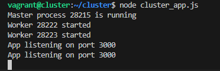

# Despliegue de una aplicación en cluster con Node Express

## Instalación de Dependencias en la VM

Dentro de la máquina virtual, ejecutamos los codigos para actualizar el sistema y para instalar Node.js y npm:

```sh
sudo apt update && sudo apt install -y nodejs npm
```

Verifica la instalación:

```sh
node -v
npm -v
```

## Creación de la Aplicación Node.js

1. **Crear el directorio del proyecto y configurarlo:**

   Esto inicializa un proyecto Node.js y genera un `package.json`.

   ```sh
   mkdir cluster_app && cd cluster_app
   npm init -y
   ```
   
2. **Instalar Express.js:**  

   Express.js nos permite crear un servidor web en Node.js.

   ```sh
   npm install express
   ```

## Código de la Aplicación en Clúster (`cluster_app.js`)

Este código usa `cluster` para distribuir la carga entre los CPU disponibles.

```js
const express = require("express");
const cluster = require("cluster");
const os = require("os");

const totalCPUs = os.cpus().length;
const port = 3000;

if (cluster.isMaster) {
    console.log(`Master ${process.pid} está corriendo`);
    
    for (let i = 0; i < totalCPUs; i++) {
        cluster.fork();
    }

    cluster.on("exit", (worker) => {
        console.log(`Worker ${worker.process.pid} murió, creando otro...`);
        cluster.fork();
    });
} else {
    const app = express();

    app.get("/", (req, res) => {
        res.send(`Hola desde Worker ${process.pid}`);
    });

    app.listen(port, "0.0.0.0", () => {
        console.log(`Worker ${process.pid} escuchando en puerto ${port}`);
    });
}
```

Este código `NO` usa `cluster`.

```js
const express = require("express");
const app = express();
const port = 3000;
const limit = 5000000000;

app.get("/", (req, res) => {
    res.send("Hello World!");
});

app.get("/api/:n", function (req, res) {
    let n = parseInt(req.params.n);
    let count = 0;

    if (n > limit) n = limit;

    for (let i = 0; i <= n; i++) {
        count += i;
    }

    res.send(`Final count is ${count}`);
});

app.listen(port, () => {
    console.log(`App listening on port ${port}`);
});
```

## Ejecución de la Aplicación

Para ejecutar la aplicación en la VM sin cluster, usa:

```sh
node app.js
```


Accede desde el navegador:

```sh
http://localhost:3000
http://localhost:3000/api/50
```


```sh
node cluster_app.js
```



Accede desde el navegador:

```sh
http://192.168.57.102:3000
http://192.168.57.102:3000/api/5000
```


## Uso de PM2 para Administrar el Clúster

1. **Instalar PM2** 

PM2 ayuda a manejar procesos en producción.

```sh
npm install -g pm2
```

2. **Crear archivo de configuración `ecosystem.config.js`**

```js
module.exports = {
    apps: [{
        name: "cluster_app",
        script: "cluster_app.js",
        instances: 0,
        exec_mode: "cluster"
    }]
};
```

3. **Iniciar la aplicación con PM2**

```sh
pm2 start ecosystem.config.js
```


4. **Comandos útiles de PM2**

```sh
pm2 ls
```


```sh
pm2 logs
```


```sh
pm2 monit
```


```sh
pm2 stop cluster_app
```


## Pruebas de Carga con `loadtest`

1. **Instalar `loadtest`**  
   `loadtest` permite simular cargas de peticiones al servidor.

```sh
npm install -g loadtest
```

2. **Ejecutar pruebas con y sin clúster**

```sh
loadtest http://192.168.57.102:3000 -n 1000 -c 100
```

**Sin Cluster**

.png)

**Con Cluster**

.png)
